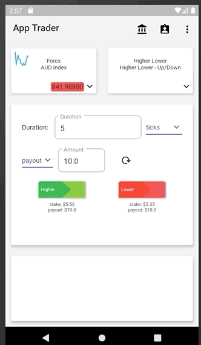
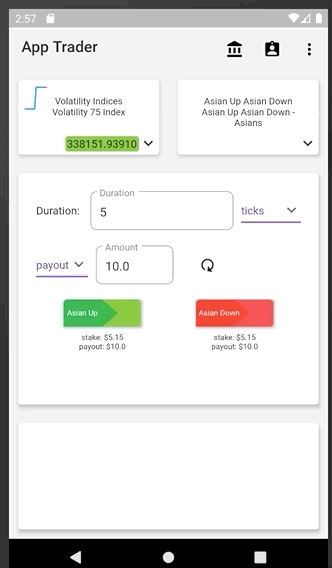

# binary_mobile_app


# A Flutter Sample App for Binary.com

A Flutter application which communicates to the Binary.com API.

    


## Usage

Make sure you have Flutter installed on your local machine. For more instructions on how to install flutter, look [here](https://flutter.io/docs/get-started/install).

```
git clone https://github.com/raminvakili-fs/binary-flutter-sample-app.git
cd binary-flutter-sample-app/lib

```

Create a file named 'api_info.dart' under '/lib' folder and put your API Token which is taken from [Binary.com](https://www.binary.com/en/user/security/api_tokenws.html):

api_info.dart:
```
const API_TOKEN = 'YOUR API TOKEN';
```

Then navigate to app main folder where the pubspec.yaml is and run following command to launch the App:
```
flutter run
```

## Overview

updating...


